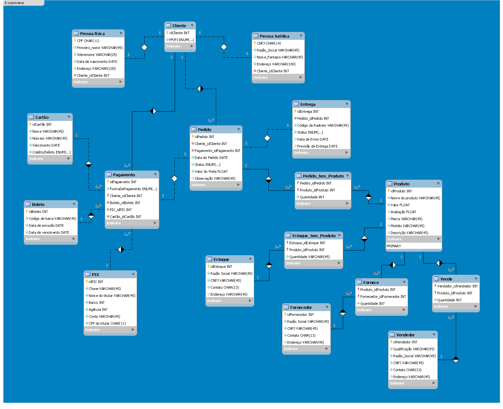
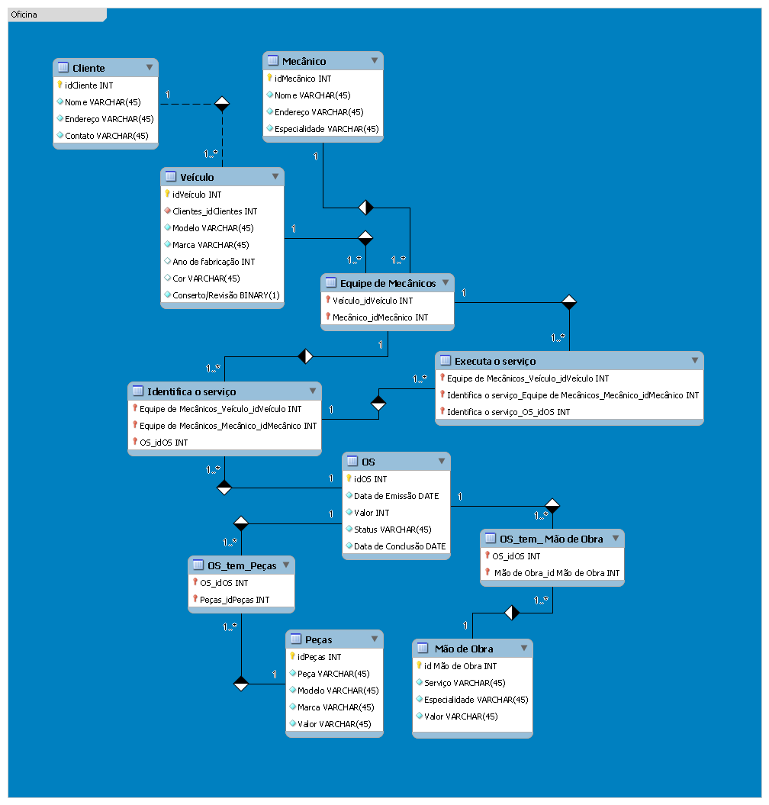

---

# DIO-Database-Experience
Repositório feito para documentar o bootcamp sobre Banco de Dados da DIO para profissionais de Ciência de Dados, com os conceitos de banco de dados SQL e NoSQL.

------

[TOC]

## **Desafios**  :zap:

### **[Refinando um Projeto Conceitual de Banco de Dados - E-COMMERCE](doc/Desafio1)** :checkered_flag: 

A entrega deste desafio foi feita a partir de práticas de Modelagem EER utilizando o MySQL Workbench. Inicialmente, foi modelado dois projetos mais simples, o primeiro de um Sistema de Ordem de Serviço, o segundo de uma Universidade, ambos [documentados na pasta do de aprendizado](doc/Aprendizado). Por fim, foi feito o Modelo EER de um E-commerce, utilizando o escopo narrativo dado durante as aulas, além dos seguintes critérios:

- Cliente PJ e PF – Uma conta pode ser PJ ou PF, mas não pode ter as duas informações;
- Pagamento – Pode ter cadastrado mais de uma forma de pagamento;
- Entrega – Possui status e código de rastreio.

Tanto os arquivos de edição da modelagem, quanto as imagem apresentada a seguir, também estão na [pasta de documentação do desafio](doc/Desafio1).

### **[Construindo um Esquema Conceitual para Banco De dados](doc/Desafio2)** :checkered_flag: 

A entrega deste desafio foi feita a partir de práticas de Modelagem EER utilizando o MySQL Workbench. Para este desafio, foi modelado do zero um banco de dados relacional de um Sistema de Ordem de Serviço para uma Oficina Mecânica. O escopo narrativo utilizado foi dados a partir dos seguintes critérios:

- Sistema de controle e gerenciamento de execução de ordens de serviço em uma oficina mecânica
- Clientes levam veículos à oficina mecânica para serem consertados ou para passarem por revisões periódicas
- Cada veículo é designado a uma equipe de mecânicos que identifica os serviços a serem executados e preenche uma OS com data de entrega.
- A partir da OS, calcula-se o valor de cada serviço, consultando-se uma tabela de referência de mão-de-obra
- O valor de cada peça também irá compor a OSO cliente autoriza a execução dos serviços
- A mesma equipe avalia e executa os serviços
- Os mecânicos possuem código, nome, endereço e especialidade
- Cada OS possui: n°, data de emissão, um valor, status e uma data para conclusão dos trabalhos.

Tanto os arquivos de edição da modelagem, quanto as imagem apresentada a seguir, também estão na [pasta de documentação do desafio](doc/Desafio2).

### **[Construindo seu Primeiro Projeto Lógico de Banco de Dados](doc/Desafio3)** :checkered_flag: 

O objetivo do *Desafio 3 - Construindo seu Primeiro Projeto Lógico de Banco de Dados* era replicar a modelagem do projeto lógico de banco de dados para o cenário de e-commerce.Foi necessário consultar a modelagem para saber como proceder com cada entidade, atributo e relacionamento. Além disso, foi ablicado um refinamento ao mapeamento de modelos do módulo de modelagem conceitual.

Assim como demonstrado durante o desafio, foi criado o Script SQL para criação do esquema do banco de dados. Posteriormente, foi realizado a persistência de dados e especificação de queries para realização de testes. As queries SQL detinham com as cláusulas abaixo:

- Recuperações simples com SELECT Statement
- Filtros com WHERE Statement
- Crie expressões para gerar atributos derivados
- Defina ordenações dos dados com ORDER BY
- Condições de filtros aos grupos – HAVING Statement
- Crie junções entre tabelas para fornecer uma perspectiva mais complexa dos dados

#### **Diretrizes**

- Não há um mínimo de queries a serem realizadas;
- Os tópicos supracitados devem estar presentes nas queries;
- Elabore perguntas que podem ser respondidas pelas consultas;
- As cláusulas podem estar presentes em mais de uma query.

### **[Construa um Projeto Lógico de Banco de Dados do Zero](doc/Desafio4)** :checkered_flag: 

Para o cenário do *Desafio 4 - Construa um Projeto Lógico de Banco de Dados do Zero* foi utilizado os esquema conceitual criado no desafio do módulo de modelagem de BD com modelo ER, no qual foi criado o esquema lógico para o contexto de uma oficina. Este esquema lógico da oficina definirá todas as etapas do atual desafio, desde o esquema até a implementação do banco de dados. 

Após a criação do esquema lógico, foi escrito o Script SQL para criação do esquema do banco de dados. Posteriormente, foi realizada a persistência de dados e elaboração  de queries para realização de testes. Foram criadas queries SQL com as cláusulas abaixo:

- Recuperações simples com SELECT Statement;
- Filtros com WHERE Statement;
- Crie expressões para gerar atributos derivados;
- Defina ordenações dos dados com ORDER BY;
- Condições de filtros aos grupos – HAVING Statement;
- Crie junções entre tabelas para fornecer uma perspectiva mais complexa dos dados;

#### **Diretrizes**

- Não há um mínimo de queries a serem realizadas;
- Os tópicos supracitados devem estar presentes nas queries;
- Elabore perguntas que podem ser respondidas pelas consultas
- As cláusulas podem estar presentes em mais de uma query

## **Entre em contato**	:speech_balloon:

[giuliano.bianco@fatec.sp.gov.br](Email)	:envelope:

[www.linkedin.com/in/giuliano-marcus-bianco/](LinkedIn)	:man_office_worker:
